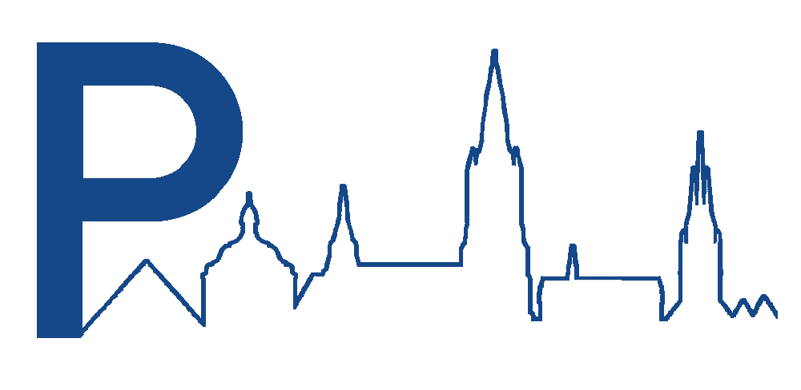

 

# ParkenUlm

_Live parking availability for garages in Ulm, Germany_

 

<table align="center" cellspacing="16" cellpadding="0">
  <tbody>
    <tr>
      <td align="center" valign="middle"></td>
      <td align="center" valign="middle"></td>
    </tr>
  </tbody>
</table>

## About

A small app to see current usage of parking garages in Ulm, Germany. Data is provided by the city of Ulm.

## Thanks

- [@Parken in Ulm](https://www.parken-in-ulm.de/) for the data
- [@BBBlakee](https://github.com/BBBlakee) for the redesign of the Android app
